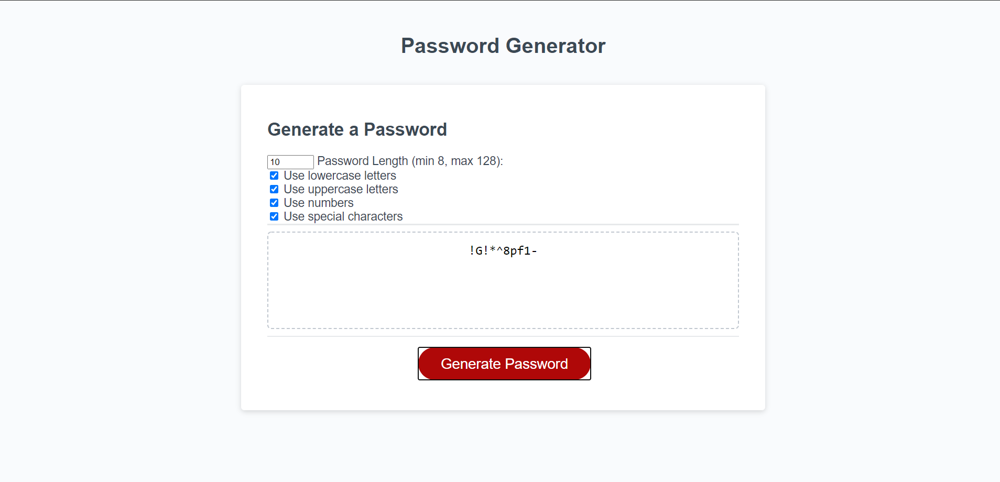

# 03 JavaScript: Password Generator

## Working Example

## About this assignment

* The acceptance criteria suggest that using alert prompts to gather input from the user about which character sets to add to their generated passwords. Our instructor always complains about how annoying alerts are in the browser, and I tend to agree. Instead, I use checkbox and number inputs in the HTML to gather boolean values for which character sets to use, and a numeric value for the length of the generated password. I then append those character sets to one array within the password generation function. It generates random numbers using the Math.random function; those numbers are the index numbers for the selected characters array. Those are then appended to a string until we reach the password length defined by the user.